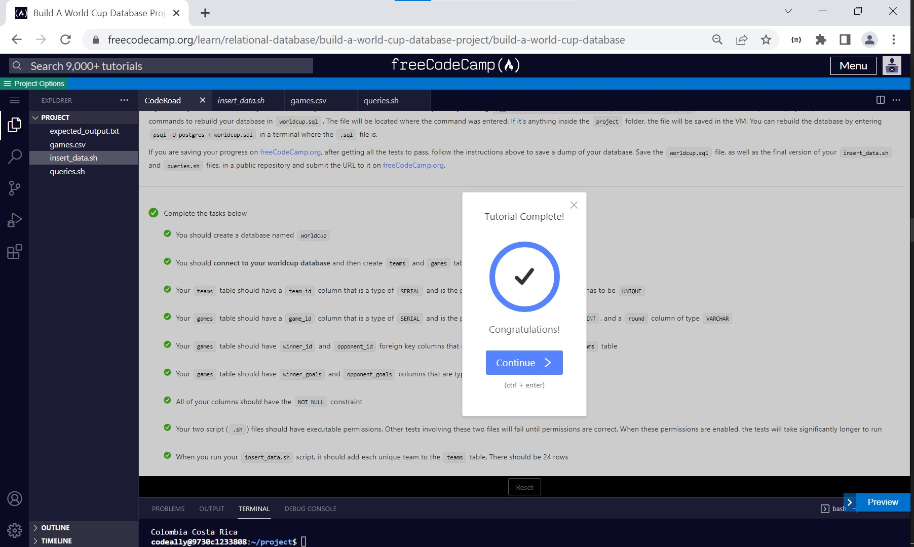
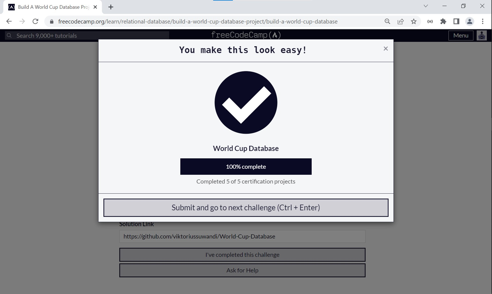

# World Cup Database
#### Open [file `solution.txt`](solution.txt) To follow my terminal command. Solutions divided into several steps :
    1. Create Database and connect to it.
    2. Create tables as required conditions.
    3. Primary Key and Foreign Key assignment.
    4. Give executable permission to shell scipt files.
    5. Copy & Run shell script files (NOTE : insert data first).
    6. Compact queries into worldcup.sql file.

#### Documentation can be found on : [https://github.com/viktoriussuwandi/World-Cup-Database](https://github.com/viktoriussuwandi/World-Cup-Database)

This is the result to complete the World Cup Database project. 
Instructions for building this project can be found at [https://www.freecodecamp.org/learn/relational-database/build-a-world-cup-database-project/build-a-world-cup-database](https://www.freecodecamp.org/learn/relational-database/build-a-world-cup-database-project/build-a-world-cup-database)

## Instructions
Follow the instructions and get all the user stories below to pass to finish the project.

You start with several files, one of them is `games.csv`. It contains a comma-separated list of all games of the final three rounds of the World Cup tournament since 2014; the titles are at the top. It includes the year of each game, the round of the game, the winner, their opponent, and the number of goals each team scored. You need to do three things for this project:

### Part 1: Create the database
Log into the psql interactive terminal with `psql --username=freecodecamp --dbname=postgres` and create your database structure according to the user stories below.

Don't forget to connect to the database after you create it.

### Part 2: Insert the data
Complete the `insert_data.sh` script to correctly insert all the data from `games.csv` into the database. The file is started for you. Do not modify any of the code you start with. Using the PSQL variable defined, you can make database queries like this: `$($PSQL "<query_here>")`. The tests have a 20 second limit, so try to make your script efficient. The less you have to query the database, the faster it will be. You can empty the rows in the tables of your database with `TRUNCATE TABLE games, teams;`

### Part 3: Query the database
Complete the empty `echo` commands in the `queries.sh `file to produce output that matches the `expected_output.txt` file. The file has some starter code, and the first query is completed for you. Use the PSQL variable defined to complete rest of the queries. Note that you need to have your database filled with the correct data from the script to get the correct results from your queries. Hint: Test your queries in the psql prompt first and then add them to the script file.

Notes:
If you leave your virtual machine, your database may not be saved. You can make a dump of it by entering `pg_dump -cC --inserts -U freecodecamp worldcup > worldcup.sql` in a bash terminal (not the psql one). It will save the commands to rebuild your database in `worldcup.sql`. The file will be located where the command was entered. If it's anything inside the `project` folder, the file will be saved in the VM. You can rebuild the database by entering `psql -U postgres < worldcup.sql` in a terminal where the `.sql` file is.

If you are saving your progress on [freeCodeCamp.org](freeCodeCamp.org), after getting all the tests to pass, follow the instructions above to save a dump of your database. Save the `worldcup.sql` file, as well as the final version of your `insert_data.sh` and `queries.sh` files, in a public repository and submit the URL to it on [freeCodeCamp.org](freeCodeCamp.org).

## CodeRoad
1. You should create a database named `worldcup`.
2. You should **connect to your worldcup database** and then create `teams` and `games` tables.
3. Your `teams` table should have a `team_id` column that is a type of `SERIAL` and is the primary key, and a `name` column that has to be `UNIQUE`.
4. Your `games` table should have a `game_id` column that is a type of `SERIAL` and is the primary key, a `year` column of type `INT`, and a `round` column of type `VARCHAR`.
5. Your `games` table should have `winner_id` and `opponent_id` foreign key columns that each reference `team_id` from the `teams` table.
6. Your `games` table should have `winner_goals` and `opponent_goals` columns that are type `INT`.
7. All of your columns should have the `NOT NULL` constraint.
8. Your two script (`.sh`) files should have `executable permissions`. Other `tests` involving these two files will fail until permissions are correct. When these `permissions` are enabled, the tests will take significantly longer to run.
9. When you run your `insert_data.sh` script, it should add each `unique team` to the `teams` table. There should be `24` rows.
10. When you run your `insert_data.sh` script, it should insert a `row` for each line in the `games.csv` file (other than the top line of the file). There should be `32` rows. Each row should have every column filled in with the appropriate info. Make sure to add the correct ID's from the `teams` table (you cannot hard-code the values).
11. You should correctly complete the queries in the `queries.sh` file. Fill in each empty echo command to get the output of what is suggested with the command above it. Only use a single line like the first query. The output should match what is in the `expected_output.txt` file **exactly**, take note of the number of decimal places in some of the query results.

## Result

### Testing

### Submission
